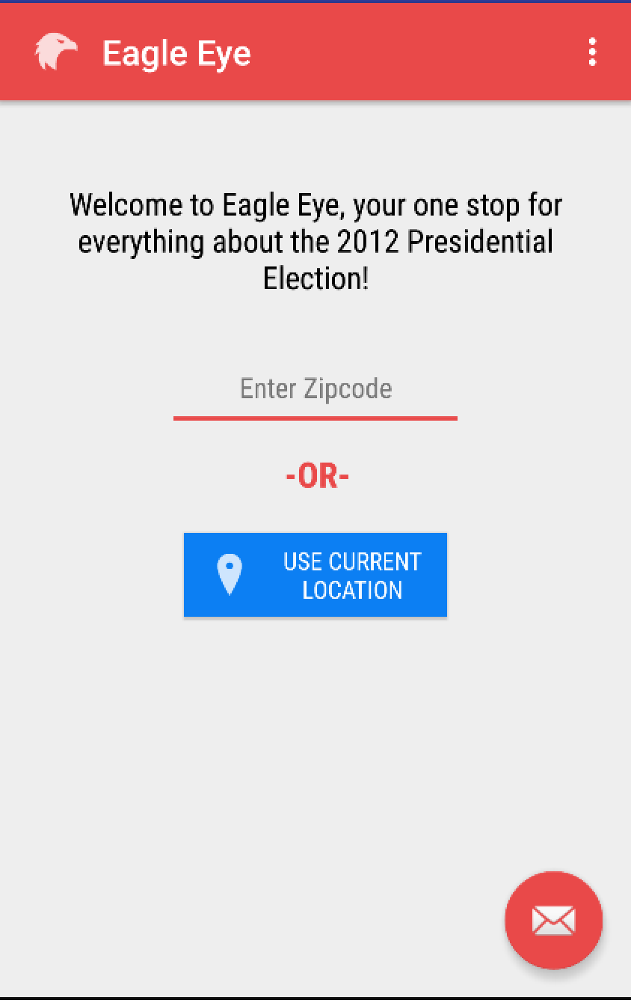

# PROG 02: Represent!

Eagle Eye allows users to find and learn about congressmen in any zipcode/district in the United States using both the watch and the phone. Users can also see the voting results in 2012 in any zipcode/district they want to. Shaking the watch will randomize the results on the phone and watch. 

## Authors

Sampath Duddu ([duddus@berkeley.edu](mailto:duddus@berkeley.edu))

## Demo Video

See [Eagle Eye Demo] (https://youtu.be/QGOfx2k5Q-c)

## Screenshots

## Acknowledgments

Thank you Stack Overflow.
Major props to Brandon Chinn, Piazza for helping out.
